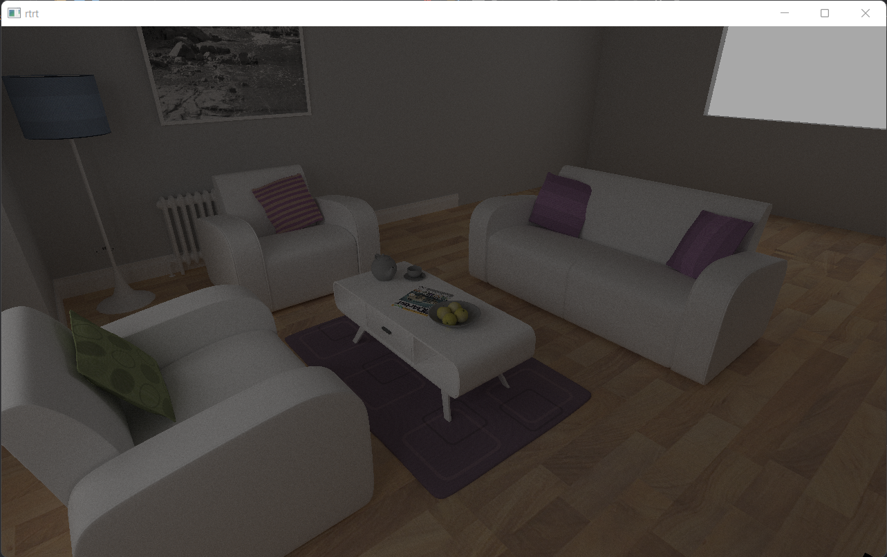

# realtime_raytracer
Realtime raytracer with basic BRDF, written in C++ and Vulkan

# Libraries
- Assimp
- GLFW
- GLM
- stb_image.h

# Future improvements
- Add denoising
- Use BSDF instead of just BRDF for transluscent objects

# Showcase

